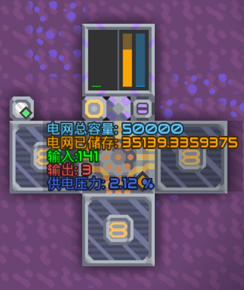

## A low consume power dashboard for Mindustry.

you can modity the first command of the CPU in game, to match your power consumption。

use base64 or msch to import to buleprint.

```txt
bXNjaAF4nAGDA3z8AAMABAIABG5hbWUAClBkYXNoYm9hcmQAC2Rlc2NyaXB0aW9uAAAEAApwb3dlci1ub2RlAA1sb2dpYy1kaXNwbGF5AA9taWNyby1wcm9jZXNzb3IAB21lc3NhZ2UAAAAEAAAAAAAIAAMBAAEAAgADAgABAAAOAAACa3ichZTPi9NAFMez4srSv2Lo4lVmkiZt9ySIS72ouL3VHMZ02o2kk+wkcdmbLMiCgiJ6EPYseNGDIKLi/jXG1b+ivjfJxDZmkYQ28977vPedNz82LGtzkoqMpAGPBKHXKKV2JxUyjRUJJZHxVDByPYkPhbotslvS+OI8azrv5JnxBjzhQZgdNUNuVHYTl2axEs2gPTROO1PFD0kQCa6IS6tXP504IYs8AnkjlKiVGxvIGmlttXUaPiKJUIGQWVXOiDNM5R3VYX1qwLt793S2UJpgsIy0GYJKhXEEE2GU2KCv+kOR2qlEkBEXHmZrubWjpGzXRaSVsu0S0zNq4zyXINrkel7J9enFFH61U3UvGixjHum5+Br2Yb5IiO0QcZBzXItGLXtIBj18/63lOWsKdSKHkkik6Xify5sHZTZjnyvBM6HQpRvPVuv0HDJ0IJnz/zorFNV9QOJiSi90gxsOdMMZawOdIXaWDFZn5a2ph2nBajaXpMy0li9TIZdzOI8gBjaHNwRJfdwqLW4X3RCEfreZmzYyz6I83YednSYRP2KdRIWw3buTbc8LgtnMP3/96fz7y5+PvxUfvvw+ebFDulVIfWQM4d+Xk1iBClFBxeePxfG74v2bv5A+bYaA+G1Kd3cp9X+dvSqevN3p4pEK8ZSFcoy9MXpguFYHLgPNnHzF3AaCTo712TQYGmoOGUAfRLnwf5ydgsbi+bPi6WmVQZ9k3Ex6Q1FaZy2N+ANXIauvgdqKsWUNHJpy5OrEr2ZddngBe5nPBetYlnXZ2tQX3HIJgy3Te/i+ZG2ZOGsDxlcSLkUEnuXyD9qUuUAAAwACAAAEAQCUWyM2NmNjZmZd55S1572R5oC75a656YePOiA2ODcyMDAwW10KW29yYW5nZV3nlLXnvZHlt7LlgqjlrZg6IDY4NzIwMDAKWyMwMEZGMDBd6L6T5YWlOjI4NTE1MltdCltyZWRd6L6T5Ye6OiAxNTAxNTRbcmVkXQpbYmx1ZV3kvpvnlLXljovlips6IDUyLjY1ICVbXQPhCI47
```

## Display





